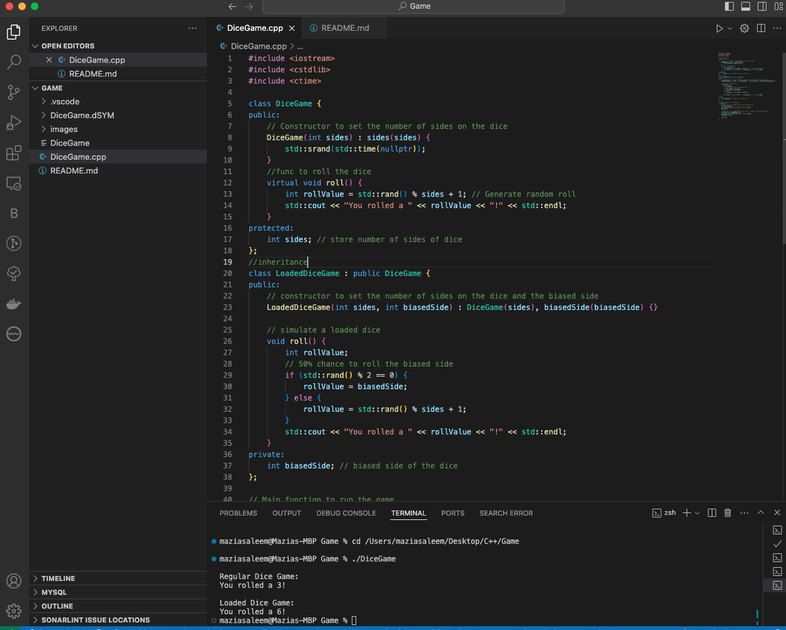

# Dice Rolling Game

This is a simple Dice Rolling Game written in C++. The game simulates rolling a six-sided dice and displays the result.

## How to Compile and Run

1. **Open a terminal** and navigate to the directory where the source files are located.
2. **Compile the code** using the following command:
   ```bash
   g++ DiceGame.cpp -o DiceGame
