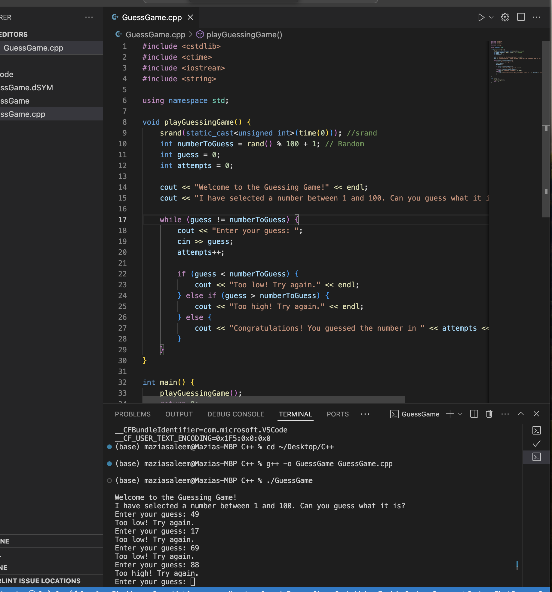

# Guessing Game

This folder contains the C++ Guessing Game project. The program uses `srand` and `rand` to generate a random number. The game lets the player know if the number is too high or too low by using a while loop and if-else statements.

## Screenshot

