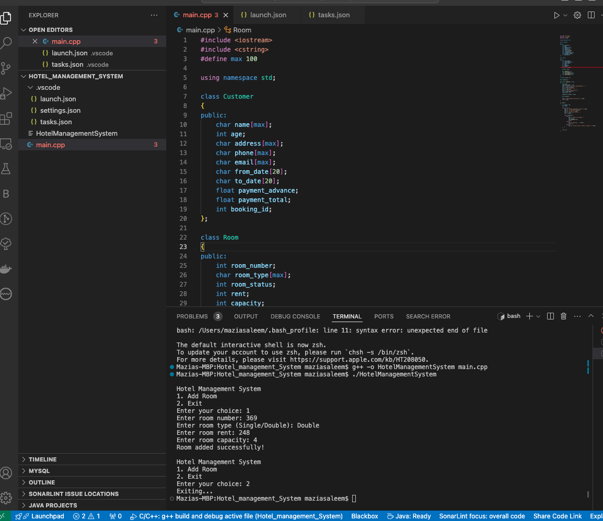

# Hotel Management System

## Overview
This is a simple Hotel Management System implemented in C++. The system allows users to add, search, display, and delete hotel room bookings. The project is designed to help beginners understand the basics of C++ programming, including object-oriented concepts, file handling, and user interaction.

## Features
- Add new room bookings.
- Search for a specific room booking.
- Display all room bookings.
- Delete room bookings.

## Prerequisites
Before you can run this project, ensure that you have the following installed:

- **C++ Compiler:** Ensure you have `g++` installed
- **Visual Studio Code:** A lightweight code editor with support for C++.